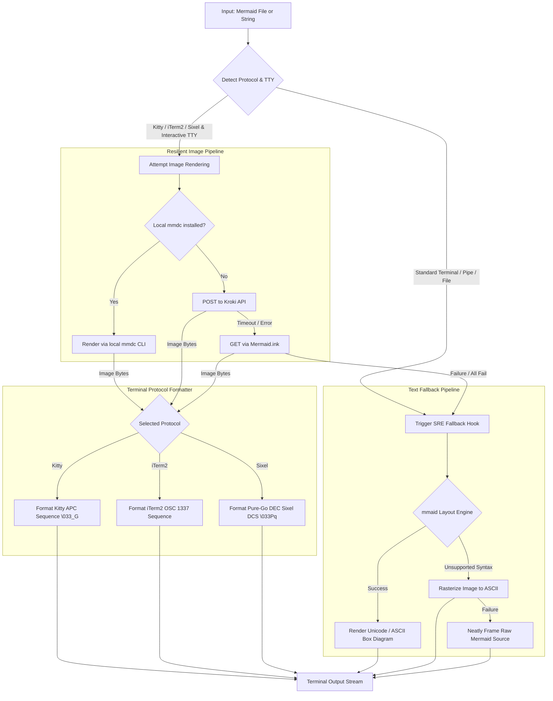

# golang-mermaid

[](https://pkg.go.dev/github.com/smford/golang-mermaid)
[](https://goreportcard.com/report/github.com/smford/golang-mermaid)
[](https://opensource.org/licenses/MIT)

**`golang-mermaid`** is a production-grade Go module designed to render and display Mermaid diagrams directly inside modern terminals using native high-resolution graphics protocols with automated ASCII/Unicode fallback.

It natively supports three major terminal graphics protocols:
- **Kitty Graphics Protocol (`APC \033_G`)**: For Kitty, Ghostty, and WezTerm.
- **iTerm2 Inline Image Protocol (`OSC 1337`)**: For iTerm2, WezTerm, Ghostty, and Mintty.
- **DEC Sixel Bitmap Protocol (`DCS \033Pq`)**: For Foot, mlterm, Mintty, and Sixel-enabled terminals.

When running in a standard terminal (such as Apple Terminal, Alacritty, Linux console, or CI/CD pipelines), when output is piped or redirected, or if image rendering services are unreachable, it **gracefully degrades** to clean, high-fidelity ASCII or Unicode box-drawing terminal art.

---

## Architecture & Reliability

Engineered with **Site Reliability Engineering (SRE)** and senior development principles:



### Key Engineering Highlights

- **Zero-Panic Resiliency**: Strict error propagation; never panics on malformed syntax or terminal anomalies.
- **Cascading Fallback**: Automatically cascades through local CLI (`mmdc`), remote REST services (Kroki, Mermaid.ink), and local pure-Go layout engines (`mmaid-go`).
- **Deadline & Timeout Budgets**: All network operations respect `context.Context` deadlines. The multi-backend image renderer automatically budgets time slices across candidates to prevent one sluggish service from exhausting the entire deadline.
- **SRE Observability Hooks**: Register custom `OnFallback` callbacks to log warnings, emit Prometheus metrics, or track terminal degradation across developer fleets.
- **TTY & Pipe Safety**: Employs interactive terminal checks via `golang.org/x/term` so that binary escape sequences are never accidentally spewed into redirected log files or shell pipes unless explicitly forced.
- **Tmux Passthrough**: Automatically detects tmux sessions and wraps escape sequences with DCS passthrough (`\033Ptmux;...\033\\`).

---

## Installation

```bash
go get github.com/smford/golang-mermaid
```

Requires Go 1.21 or later.

---

## Quick Start

### 1. Print a Diagram String

```go
package main

import (
    "log"
    mermaid "github.com/smford/golang-mermaid"
)

func main() {
    chart := `
    graph TD
        Client[Client App] --> LB[Load Balancer]
        LB --> Web1[Web Server 1]
        LB --> Web2[Web Server 2]
    `

    if err := mermaid.Print(chart); err != nil {
        log.Fatalf("Failed to print diagram: %v", err)
    }
}
```

### 2. Print a Mermaid File from Disk

```go
package main

import (
    "log"
    mermaid "github.com/smford/golang-mermaid"
)

func main() {
    if err := mermaid.PrintFile("testdata/architecture.mmd"); err != nil {
        log.Fatalf("Failed to render diagram: %v", err)
    }
}
```

---

## Configuration & Options

`golang-mermaid` uses the functional options pattern for complete flexibility:

```go
printer := mermaid.New(
    // Rendering mode: ModeAuto (default), ModeImage, ModeASCII, ModeUnicode
    mermaid.WithMode(mermaid.ModeAuto),

    // Terminal graphics protocol: ProtocolAuto (default), ProtocolKitty, ProtocolITerm2, ProtocolSixel, ProtocolNone
    mermaid.WithGraphicsProtocol(mermaid.ProtocolAuto),

    // Display dimensions (iTerm2 and Kitty)
    mermaid.WithWidth("80%"),
    mermaid.WithHeight("auto"),
    mermaid.WithPreserveAspectRatio(true),

    // Execution timeout for external renderers
    mermaid.WithTimeout(8 * time.Second),

    // Output destination (defaults to os.Stdout)
    mermaid.WithWriter(os.Stdout),

    // SRE Observability callback
    mermaid.WithOnFallback(func(reason string, err error) {
        log.Printf("[OBSERVABILITY] Degraded to ASCII diagram: %s", reason)
    }),
)

err := printer.PrintFile("testdata/incident_response.mmd")
```

### Supported Options

| Option | Description | Default |
| :--- | :--- | :--- |
| `WithMode(mode)` | Set render mode (`ModeAuto`, `ModeImage`, `ModeASCII`, `ModeUnicode`) | `ModeAuto` |
| `WithGraphicsProtocol(proto)` | Terminal graphics protocol (`ProtocolAuto`, `ProtocolKitty`, `ProtocolITerm2`, `ProtocolSixel`, `ProtocolNone`) | `ProtocolAuto` |
| `WithTheme(theme)` | Text/ASCII theme (`"default"`, `"slate"`, `"blueprint"`, `"neon"`, `"amber"`, `"phosphor"`, `"monokai"`) | `"default"` |
| `WithBoxFrame(bool)` | Wrap text/ASCII diagram in an elegant executive card border | `false` |
| `WithTitle(title)` | Display a diagram title embedded in the card frame header | `""` |
| `WithColumns(cols)` | Character columns for layout (0 auto-detects terminal width; defaults to 120) | `0` |
| `WithPadding(x, y)` | Horizontal and vertical padding inside node boxes | `(1, 0)` |
| `WithSharpEdges(bool)` | Use sharp box corners (`┌──┐`) instead of rounded (`╭──╮`) | `false` |
| `WithHyperlinks(bool)` | Enable OSC 8 clickable terminal hyperlinks for diagrams with click events | `false` |
| `WithWidth(width)` | Set display width in iTerm2/Kitty (`"auto"`, `"80%"`, `"800px"`, `"60cell"`) | `"auto"` |
| `WithHeight(height)` | Set display height in iTerm2/Kitty (`"auto"`, `"400px"`, `"30cell"`) | `"auto"` |
| `WithPreserveAspectRatio(bool)` | Maintain image aspect ratio in iTerm2 | `true` |
| `WithScale(scale)` | Rasterization scale factor for HiDPI/Retina display (`1.0`, `2.0`, `3.0`) | `1.0` |
| `WithTimeout(duration)` | Maximum time budget for rendering requests | `10s` |
| `WithWriter(w)` | Destination `io.Writer` | `os.Stdout` |
| `WithOnFallback(fn)` | Callback executed whenever fallback from image to text occurs | `nil` |
| `WithAllowCompatibleTerminals(bool)` | Allow terminals that implement OSC 1337 or Kitty (e.g. WezTerm, Ghostty) | `true` |
| `WithForceTTY(bool)` | Bypass TTY detection (useful in automated tests or pseudo-terminals) | `false` |
| `WithDisableFallback(bool)` | Fail immediately with error instead of falling back to ASCII | `false` |
| `WithImageRenderer(r)` | Supply a custom implementation of `ImageRenderer` | Resilient chain |
| `WithTextRenderer(r)` | Supply a custom implementation of `TextRenderer` | Fallback text |

---

## In-Memory Rendering

If you want the formatted output string or raw image bytes without printing directly to a terminal stream:

```go
ctx := context.Background()
res, err := mermaid.Render(ctx, diagramSource, mermaid.WithMode(mermaid.ModeAuto))
if err != nil {
    log.Fatal(err)
}

fmt.Printf("Rendered in: %v\n", res.Duration)
fmt.Printf("Actual Mode: %s\n", res.Mode)
fmt.Printf("Fallback Occurred: %v (Reason: %s)\n", res.FallbackOccurred, res.FallbackReason)

if res.Mode == mermaid.ModeImage {
    fmt.Printf("Received %d bytes of PNG image data\n", len(res.ImageData))
}

// Print formatted terminal sequence or text art:
fmt.Print(res.Output)
```

---

## Working Example & CLI Application

The repository includes both a simple example and a production CLI utility:

### Simple Example

```bash
go run examples/simple/main.go testdata/architecture.mmd
```

### CLI Tool (`mermaid-term`)

Build and run the full-featured CLI:

```bash
# Build
go build -o bin/mermaid-term cmd/mermaid-term/main.go

# Auto-detect (iTerm2 image or ASCII)
./bin/mermaid-term testdata/architecture.mmd

# Force ASCII mode
./bin/mermaid-term -mode=ascii testdata/incident_response.mmd

# Force Unicode mode
./bin/mermaid-term -mode=unicode testdata/sequence_auth.mmd

# Enable verbose SRE diagnostic logs
./bin/mermaid-term -v testdata/state_machine.mmd

# Read diagram from stdin
cat testdata/database_er.mmd | ./bin/mermaid-term
```

---

## Test Diagrams Included

Five test diagrams are provided under [`testdata/`](testdata/):

1. **`architecture.mmd`**: Microservices topology with CloudFront, ALB, VPC, Kafka, Redis, and PostgreSQL.
2. **`incident_response.mmd`**: SRE incident response runbook and escalation flowchart.
3. **`sequence_auth.mmd`**: Zero-trust authentication sequence with Okta SSO, WebAuthn MFA, and HashiCorp Vault.
4. **`state_machine.mmd`**: Kubernetes Pod lifecycle state transitions (`CrashLoopBackOff`, `Running`, etc.).
5. **`database_er.mmd`**: Relational data model for Service Level Objectives (SLOs) and incident tracking.

---

## Terminal Graphics Protocols

`golang-mermaid` features pure-Go implementations of the top three modern terminal graphics standards:

### 1. Kitty Graphics Protocol (`APC \033_G`)
- **Supported by**: Kitty, Ghostty, WezTerm.
- **Specification**: Encodes images via Application Program Command (`\033_G<control>;<base64>\033\`).
- **Chunked Streaming**: Payloads exceeding 4096 bytes are automatically chunked into 4KB payloads with `m=1` (more chunks) and `m=0` (terminal chunk).
- **Quiet Mode**: Dispatches with `q=2` to suppress unsolicited terminal acknowledgment responses, ensuring clean stdout.
- **Grid Layout**: Allows cell-based placement (`c=<cols>`, `r=<rows>`).

### 2. iTerm2 Inline Image Protocol (`OSC 1337`)
- **Supported by**: iTerm2, WezTerm, Ghostty, Mintty.
- **Specification**: Operating System Command (`\033]1337;File=[args]:<base64>\a`).
- **Options**: Supports `inline=1`, `width=<value>`, `height=<value>`, and `preserveAspectRatio=1`.

### 3. DEC Sixel Bitmap Graphics (`DCS \033Pq`)
- **Supported by**: Foot, mlterm, Mintty, xterm (with Sixel enabled).
- **Pure-Go Architecture**: 100% native Go with **zero Cgo** or external library dependencies.
- **Palette Quantization**: Dynamically samples and quantizes image palettes up to 256 colors (`#<idx>;2;r%;g%;b%`).
- **Band Packing & Compression**: Encodes 6-pixel vertical slices per row mapped into printable ASCII characters (`?` through `~`) with Run-Length Encoding (RLE) compression (`!<count><char>`).

### Tmux Passthrough
All graphics escape codes (Kitty APC, iTerm2 OSC, and Sixel DCS) automatically detect tmux environments and wrap escape sequences inside tmux DCS passthrough:
```
\033Ptmux;\033<sequence-with-doubled-esc>\033\\
```

---

## Terminal Compatibility

| Terminal Emulator | Default Protocol | Display Output | Notes |
| :--- | :--- | :--- | :--- |
| **Kitty** | `kitty` | 🖼️ Native Inline Image | High-speed Kitty graphics (`\033_G`) with chunking |
| **Ghostty** | `kitty` | 🖼️ Native Inline Image | Native Kitty protocol preferred; OSC 1337 also supported |
| **WezTerm** | `iterm2` | 🖼️ Native Inline Image | Full OSC 1337 and Kitty protocol support |
| **iTerm2** | `iterm2` | 🖼️ Native Inline Image | Native OSC 1337 inline image protocol |
| **Foot** | `sixel` | 🖼️ Native Inline Image | High-performance DEC Sixel bitmap graphics |
| **mlterm** | `sixel` | 🖼️ Native Inline Image | DEC Sixel bitmap protocol |
| **mintty** | `iterm2` | 🖼️ Native Inline Image | Windows terminal with OSC 1337 and Sixel |
| **Apple Terminal** | `none` | 🔤 Unicode Box Art | Graceful fallback (no image protocol support) |
| **Alacritty** | `none` | 🔤 Unicode Box Art | Graceful fallback (terminal does not support graphics) |
| **CI/CD Runners** | `none` | 🔤 Unicode / ASCII | Graceful fallback (non-interactive TTY) |
| **Output piped to file** | `none` | 🔤 Unicode / ASCII | Safe TTY detection protects output files from binary escape codes |

---

## Testing

Run the test suite with the Go race detector:

```bash
go test -v -race ./...
```

All unit tests and diagram validation tests run with 100% pass rate.

---

## License

MIT License. See [LICENSE](LICENSE) for details.
