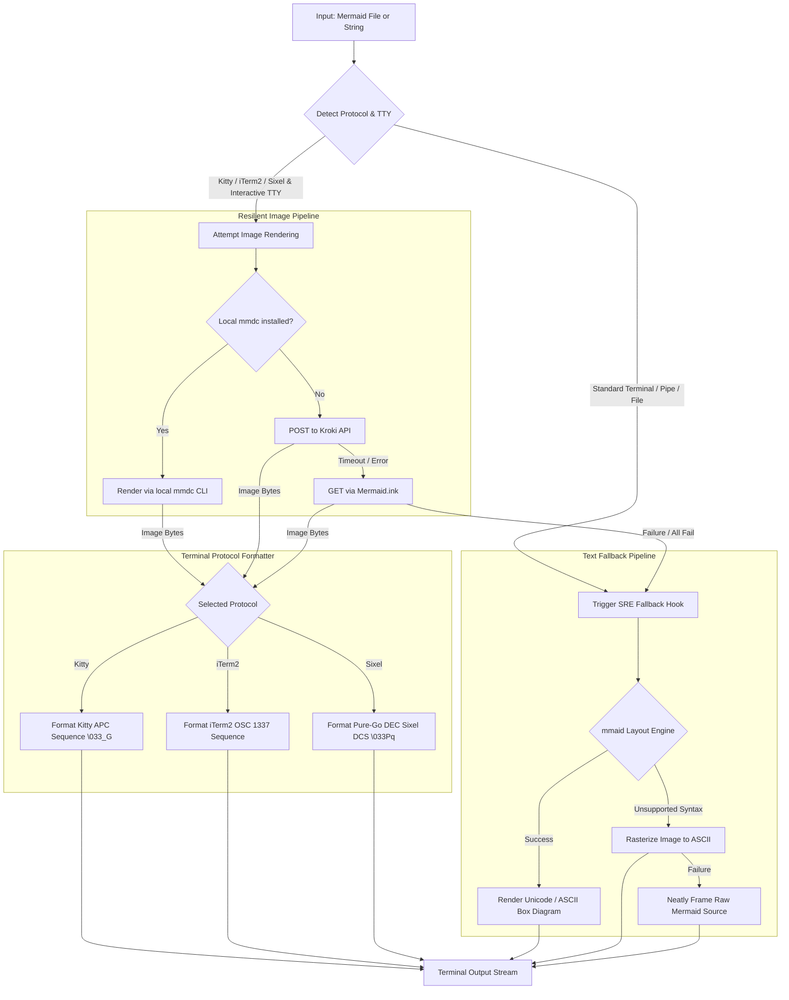

# golang-mermaid

[](https://pkg.go.dev/github.com/smford/golang-mermaid)
[](https://github.com/smford/golang-mermaid/releases)
[](https://github.com/smford/golang-mermaid/actions/workflows/ci.yml)
[](.github/dependabot.yml)
[](https://goreportcard.com/report/github.com/smford/golang-mermaid)
[](https://opensource.org/licenses/MIT)

**`golang-mermaid`** is a production-grade Go module designed to render and display Mermaid diagrams directly inside modern terminals using native high-resolution graphics protocols with automated ASCII/Unicode fallback.

It natively supports three major terminal graphics protocols:
- **Kitty Graphics Protocol (`APC \033_G`)**: For Kitty, Ghostty, and WezTerm.
- **iTerm2 Inline Image Protocol (`OSC 1337`)**: For iTerm2, WezTerm, Ghostty, and Mintty.
- **DEC Sixel Bitmap Protocol (`DCS \033Pq`)**: For Foot, mlterm, Mintty, and Sixel-enabled terminals.

When running in a standard terminal (such as Apple Terminal, Alacritty, Linux console, or CI/CD pipelines), when output is piped or redirected, or if image rendering services are unreachable, it **gracefully degrades** to clean, high-fidelity ASCII or Unicode box-drawing terminal art.

---

## Architecture & Reliability

Engineered with **Site Reliability Engineering (SRE)** and senior development principles:



### Key Engineering Highlights

- **Zero-Panic Resiliency**: Strict error propagation; never panics on malformed syntax or terminal anomalies.
- **Multi-Protocol Graphics**: Native pure-Go implementations of Kitty (`\033_G`), iTerm2 (`OSC 1337`), and DEC Sixel (`\033Pq`) graphics protocols.
- **Cascading Fallback**: Automatically cascades through local CLI (`mmdc`), remote REST services (Kroki, Mermaid.ink), and local pure-Go layout engines (`mmaid-go`).
- **Content-Addressed Caching**: Disk (`~/.cache/golang-mermaid`) and in-memory caches indexed by SHA-256 hashes of diagram source and configuration.
- **Air-Gapped & Offline Mode**: Enforces zero external HTTP calls with immediate fallback to local binaries or Unicode text art.
- **Markdown Runbook Extractor**: Automatically parses Markdown operational documents and replaces ` ```mermaid ` blocks inline with rendered terminal output.
- **In-Band PTY Probing**: Probes terminal graphics capabilities via Primary Device Attributes (`\033[c`) for remote SSH environments.
- **Interactive 2D Pan & Zoom Pager**: Fullscreen alternate buffer navigation with vi keys (`hjkl`), arrow keys, and page scrolling.
- **Production Telemetry & Metrics**: Structured events, thread-safe stats accumulator, and Prometheus exposition metrics format.
- **Deadline & Timeout Budgets**: All network operations respect `context.Context` deadlines.
- **TTY & Pipe Safety**: Interactive terminal detection protects pipes and redirected log files from binary escape sequences.
- **Tmux Passthrough**: Automatically wraps escape sequences inside tmux DCS passthrough (`\033Ptmux;...\033\\`).

---

## Installation

### For Go Applications & Modules

To use `golang-mermaid` as a dependency in another Go application:

```bash
# Add specific SemVer release to your go.mod
go get github.com/smford/golang-mermaid@v1.0.0

# Or get the latest stable version
go get github.com/smford/golang-mermaid@latest
```

Import in your Go code:
```go
import mermaid "github.com/smford/golang-mermaid"
```

The current version can also be inspected programmatically:
```go
fmt.Println(mermaid.Version) // "1.0.0"
```

### Standalone CLI Tool (`mermaid-term`)

Install the binary directly with `go install`:
```bash
go install github.com/smford/golang-mermaid/cmd/mermaid-term@v1.0.0
```

Pre-compiled cross-platform archives for macOS (Apple Silicon & Intel), Linux (`amd64`, `arm64`), and Windows (`amd64`) are also available from [GitHub Releases](https://github.com/smford/golang-mermaid/releases).

---

## Quick Start

### 1. Print a Diagram String

```go
package main

import (
    "log"
    mermaid "github.com/smford/golang-mermaid"
)

func main() {
    chart := `
    graph TD
        Client[Client App] --> LB[Load Balancer]
        LB --> Web1[Web Server 1]
        LB --> Web2[Web Server 2]
    `

    if err := mermaid.Print(chart); err != nil {
        log.Fatalf("Failed to print diagram: %v", err)
    }
}
```

### 2. Print a Mermaid File from Disk

```go
package main

import (
    "log"
    mermaid "github.com/smford/golang-mermaid"
)

func main() {
    if err := mermaid.PrintFile("testdata/architecture.mmd"); err != nil {
        log.Fatalf("Failed to render diagram: %v", err)
    }
}
```

---

## Configuration & Options

`golang-mermaid` uses the functional options pattern for complete flexibility:

```go
printer := mermaid.New(
    // Rendering mode: ModeAuto (default), ModeImage, ModeASCII, ModeUnicode
    mermaid.WithMode(mermaid.ModeAuto),

    // Terminal graphics protocol: ProtocolAuto (default), ProtocolKitty, ProtocolITerm2, ProtocolSixel, ProtocolNone
    mermaid.WithGraphicsProtocol(mermaid.ProtocolAuto),

    // Display dimensions (iTerm2 and Kitty)
    mermaid.WithWidth("80%"),
    mermaid.WithHeight("auto"),
    mermaid.WithPreserveAspectRatio(true),

    // Execution timeout for external renderers
    mermaid.WithTimeout(8 * time.Second),

    // Output destination (defaults to os.Stdout)
    mermaid.WithWriter(os.Stdout),

    // SRE Observability callback
    mermaid.WithOnFallback(func(reason string, err error) {
        log.Printf("[OBSERVABILITY] Degraded to ASCII diagram: %s", reason)
    }),
)

err := printer.PrintFile("testdata/incident_response.mmd")
```

### Supported Options

| Option | Description | Default |
| :--- | :--- | :--- |
| `WithMode(mode)` | Set render mode (`ModeAuto`, `ModeImage`, `ModeASCII`, `ModeUnicode`) | `ModeAuto` |
| `WithGraphicsProtocol(proto)` | Terminal graphics protocol (`ProtocolAuto`, `ProtocolKitty`, `ProtocolITerm2`, `ProtocolSixel`, `ProtocolNone`) | `ProtocolAuto` |
| `WithTheme(theme)` | Text/ASCII theme (`"default"`, `"slate"`, `"blueprint"`, `"neon"`, `"amber"`, `"phosphor"`, `"monokai"`) | `"default"` |
| `WithBoxFrame(bool)` | Wrap text/ASCII diagram in an elegant executive card border | `false` |
| `WithTitle(title)` | Display a diagram title embedded in the card frame header | `""` |
| `WithColumns(cols)` | Character columns for layout (0 auto-detects terminal width; defaults to 120) | `0` |
| `WithPadding(x, y)` | Horizontal and vertical padding inside node boxes | `(1, 0)` |
| `WithSharpEdges(bool)` | Use sharp box corners (`┌──┐`) instead of rounded (`╭──╮`) | `false` |
| `WithHyperlinks(bool)` | Enable OSC 8 clickable terminal hyperlinks for diagrams with click events | `false` |
| `WithWidth(width)` | Set display width in iTerm2/Kitty (`"auto"`, `"80%"`, `"800px"`, `"60cell"`) | `"auto"` |
| `WithHeight(height)` | Set display height in iTerm2/Kitty (`"auto"`, `"400px"`, `"30cell"`) | `"auto"` |
| `WithPreserveAspectRatio(bool)` | Maintain image aspect ratio in iTerm2 | `true` |
| `WithScale(scale)` | Rasterization scale factor for HiDPI/Retina display (`1.0`, `2.0`, `3.0`) | `1.0` |
| `WithTimeout(duration)` | Maximum time budget for rendering requests | `10s` |
| `WithWriter(w)` | Destination `io.Writer` | `os.Stdout` |
| `WithOnFallback(fn)` | Callback executed whenever fallback from image to text occurs | `nil` |
| `WithAllowCompatibleTerminals(bool)` | Allow terminals that implement OSC 1337 or Kitty (e.g. WezTerm, Ghostty) | `true` |
| `WithForceTTY(bool)` | Bypass TTY detection (useful in automated tests or pseudo-terminals) | `false` |
| `WithDisableFallback(bool)` | Fail immediately with error instead of falling back to ASCII | `false` |
| `WithOffline(bool)` | Enforce air-gapped/offline mode (skips remote renderers, uses local mmdc or text) | `false` |
| `WithTerminalProbe(bool)` | Probe terminal capabilities via in-band PTY queries (`\033[c`) for SSH | `false` |
| `WithInteractive(bool)` | Launch interactive 2D pan & zoom terminal pager for large diagrams | `false` |
| `WithCache(bool)` | Enable content-addressed disk & memory caching | `false` |
| `WithCacheDir(dir)` | Custom disk cache directory path (defaults to `~/.cache/golang-mermaid`) | `""` |
| `WithCacheTTL(duration)` | Time-to-live for cached diagram renders | `24h` |
| `WithImageRenderer(r)` | Supply a custom implementation of `ImageRenderer` | Resilient chain |
| `WithTextRenderer(r)` | Supply a custom implementation of `TextRenderer` | Fallback text |
| `WithTelemetry(recorder)` | Register a metrics recorder (`StatsRecorder` or custom APM adapter) | `nil` |
| `WithTelemetryFunc(fn)` | Register a functional callback for render telemetry | `nil` |

---

## In-Memory Rendering

If you want the formatted output string or raw image bytes without printing directly to a terminal stream:

```go
ctx := context.Background()
res, err := mermaid.Render(ctx, diagramSource, mermaid.WithMode(mermaid.ModeAuto))
if err != nil {
    log.Fatal(err)
}

fmt.Printf("Rendered in: %v\n", res.Duration)
fmt.Printf("Actual Mode: %s\n", res.Mode)
fmt.Printf("Fallback Occurred: %v (Reason: %s)\n", res.FallbackOccurred, res.FallbackReason)

if res.Mode == mermaid.ModeImage {
    fmt.Printf("Received %d bytes of PNG image data\n", len(res.ImageData))
}

// Print formatted terminal sequence or text art:
fmt.Print(res.Output)
```

---

## Working Example & CLI Application

The repository includes both a simple example and a production CLI utility:

### Simple Example

```bash
go run examples/simple/main.go testdata/architecture.mmd
```

### CLI Tool (`mermaid-term`)

Build and run the full-featured CLI:

```bash
# Build binary
go build -o bin/mermaid-term cmd/mermaid-term/main.go

# 1. Auto-detect graphics protocol (Kitty, iTerm2, Sixel, or ASCII fallback)
./bin/mermaid-term testdata/architecture.mmd

# 2. Select explicit graphics protocol
./bin/mermaid-term -protocol=kitty testdata/sequence_auth.mmd
./bin/mermaid-term -protocol=sixel testdata/state_machine.mmd

# 3. Interactive 2D pan & zoom terminal pager (arrow keys / hjkl / q)
./bin/mermaid-term -interactive testdata/architecture.mmd

# 4. In-band PTY capability probing (\033[c) for SSH environments
./bin/mermaid-term -probe testdata/architecture.mmd

# 5. Render an entire Markdown runbook with embedded diagrams inline
./bin/mermaid-term testdata/runbook.md

# 6. Air-gapped / offline mode (zero remote HTTP network requests)
./bin/mermaid-term -offline testdata/architecture.mmd

# 7. Export Prometheus SRE metrics on exit
./bin/mermaid-term -metrics testdata/architecture.mmd

# 8. Force ASCII / Unicode mode with card frame styling
./bin/mermaid-term -mode=ascii -frame -title="Incident Triage" testdata/incident_response.mmd
./bin/mermaid-term -mode=unicode -frame -theme=slate testdata/state_machine.mmd

# 9. Clear cache
./bin/mermaid-term -clear-cache

# 10. Read diagram from stdin
cat testdata/database_er.mmd | ./bin/mermaid-term
```

---

## Test Diagrams & Runbooks Included

Six test fixtures are provided under [`testdata/`](testdata/):

1. **`architecture.mmd`**: Microservices topology with CloudFront, ALB, VPC, Kafka, Redis, and PostgreSQL.
2. **`incident_response.mmd`**: SRE incident response runbook and escalation flowchart.
3. **`sequence_auth.mmd`**: Zero-trust authentication sequence with Okta SSO, WebAuthn MFA, and HashiCorp Vault.
4. **`state_machine.mmd`**: Kubernetes Pod lifecycle state transitions (`CrashLoopBackOff`, `Running`, etc.).
5. **`database_er.mmd`**: Relational data model for Service Level Objectives (SLOs) and incident tracking.
6. **`runbook.md`**: Operations incident response document embedding Markdown text and live Mermaid diagrams.

---

## Terminal Graphics Protocols

`golang-mermaid` features pure-Go implementations of the top three modern terminal graphics standards:

### 1. Kitty Graphics Protocol (`APC \033_G`)
- **Supported by**: Kitty, Ghostty, WezTerm.
- **Specification**: Encodes images via Application Program Command (`\033_G<control>;<base64>\033\`).
- **Chunked Streaming**: Payloads exceeding 4096 bytes are automatically chunked into 4KB payloads with `m=1` (more chunks) and `m=0` (terminal chunk).
- **Quiet Mode**: Dispatches with `q=2` to suppress unsolicited terminal acknowledgment responses, ensuring clean stdout.
- **Grid Layout**: Allows cell-based placement (`c=<cols>`, `r=<rows>`).

### 2. iTerm2 Inline Image Protocol (`OSC 1337`)
- **Supported by**: iTerm2, WezTerm, Ghostty, Mintty.
- **Specification**: Operating System Command (`\033]1337;File=[args]:<base64>\a`).
- **Options**: Supports `inline=1`, `width=<value>`, `height=<value>`, and `preserveAspectRatio=1`.

### 3. DEC Sixel Bitmap Graphics (`DCS \033Pq`)
- **Supported by**: Foot, mlterm, Mintty, xterm (with Sixel enabled).
- **Pure-Go Architecture**: 100% native Go with **zero Cgo** or external library dependencies.
- **Palette Quantization**: Dynamically samples and quantizes image palettes up to 256 colors (`#<idx>;2;r%;g%;b%`).
- **Band Packing & Compression**: Encodes 6-pixel vertical slices per row mapped into printable ASCII characters (`?` through `~`) with Run-Length Encoding (RLE) compression (`!<count><char>`).

### Tmux Passthrough
All graphics escape codes (Kitty APC, iTerm2 OSC, and Sixel DCS) automatically detect tmux environments and wrap escape sequences inside tmux DCS passthrough:
```
\033Ptmux;\033<sequence-with-doubled-esc>\033\\
```

---

## Terminal Compatibility

| Terminal Emulator | Default Protocol | Display Output | Notes |
| :--- | :--- | :--- | :--- |
| **Kitty** | `kitty` | 🖼️ Native Inline Image | High-speed Kitty graphics (`\033_G`) with chunking |
| **Ghostty** | `kitty` | 🖼️ Native Inline Image | Native Kitty protocol preferred; OSC 1337 also supported |
| **WezTerm** | `iterm2` | 🖼️ Native Inline Image | Full OSC 1337 and Kitty protocol support |
| **iTerm2** | `iterm2` | 🖼️ Native Inline Image | Native OSC 1337 inline image protocol |
| **Foot** | `sixel` | 🖼️ Native Inline Image | High-performance DEC Sixel bitmap graphics |
| **mlterm** | `sixel` | 🖼️ Native Inline Image | DEC Sixel bitmap protocol |
| **mintty** | `iterm2` | 🖼️ Native Inline Image | Windows terminal with OSC 1337 and Sixel |
| **Apple Terminal** | `none` | 🔤 Unicode Box Art | Graceful fallback (no image protocol support) |
| **Alacritty** | `none` | 🔤 Unicode Box Art | Graceful fallback (terminal does not support graphics) |
| **CI/CD Runners** | `none` | 🔤 Unicode / ASCII | Graceful fallback (non-interactive TTY) |
| **Output piped to file** | `none` | 🔤 Unicode / ASCII | Safe TTY detection protects output files from binary escape codes |

---

## Production Telemetry & Prometheus Metrics

For SRE operations and cluster observability, `golang-mermaid` includes built-in telemetry:

```go
stats := mermaid.NewStatsRecorder()

printer := mermaid.New(
    mermaid.WithTelemetry(stats),
)

// Perform diagram renders...
printer.PrintFile("testdata/architecture.mmd")

// Access accumulated SRE metrics:
fmt.Printf("Total Renders:   %d\n", stats.TotalRenders)
fmt.Printf("Image Renders:   %d\n", stats.ImageRenders)
fmt.Printf("Text Renders:    %d\n", stats.TextRenders)
fmt.Printf("Cache Hits:      %d\n", stats.CacheHits)
fmt.Printf("Fallbacks:       %d\n", stats.Fallbacks)
fmt.Printf("Average Latency: %v\n", stats.AverageDuration())

// Export Prometheus exposition metrics format:
fmt.Println(stats.ExportPrometheus())
```

In the CLI tool, pass `-metrics` to export Prometheus metrics on exit to `stderr`:
```bash
mermaid-term -metrics testdata/architecture.mmd
```

Sample Prometheus exposition output:
```text
# HELP mermaid_renders_total Total number of diagram renders.
# TYPE mermaid_renders_total counter
mermaid_renders_total 1
# HELP mermaid_renders_by_mode_total Total number of renders by mode.
# TYPE mermaid_renders_by_mode_total counter
mermaid_renders_by_mode_total{mode="image"} 1
mermaid_renders_by_mode_total{mode="text"} 0
# HELP mermaid_fallbacks_total Total number of image fallbacks triggered.
# TYPE mermaid_fallbacks_total counter
mermaid_fallbacks_total 0
# HELP mermaid_cache_hits_total Total number of diagram cache hits.
# TYPE mermaid_cache_hits_total counter
mermaid_cache_hits_total 0
# HELP mermaid_render_duration_seconds_total Total duration of diagram renders in seconds.
# TYPE mermaid_render_duration_seconds_total counter
mermaid_render_duration_seconds_total 0.042180
```

---

## Testing

Run the test suite with the Go race detector:

```bash
go test -v -race ./...
```

All unit tests and diagram validation tests run with 100% pass rate.

---

## Semantic Versioning & Release Pipeline

This project strictly adheres to [Semantic Versioning 2.0.0](https://semver.org/) (`vMAJOR.MINOR.PATCH`):
- **MAJOR**: Incompatible API modifications.
- **MINOR**: Backward-compatible new features (e.g. graphics protocols, new cache backends).
- **PATCH**: Backward-compatible bug fixes and performance optimizations.

### Automated GitHub Release Workflow

Releases are fully automated via GitHub Actions ([`.github/workflows/release.yml`](.github/workflows/release.yml)):

1. **Continuous Verification**: Runs `go test -race ./...`, `go vet ./...`, and verifies `go mod verify`.
2. **Cross-Platform Compilation**: Compiles standalone binaries of `mermaid-term` with symbol stripping (`-s -w`) for:
   - `darwin/amd64` (macOS Intel)
   - `darwin/arm64` (macOS Apple Silicon)
   - `linux/amd64` (Linux x86_64)
   - `linux/arm64` (Linux ARM64 / Graviton)
   - `windows/amd64` (Windows x86_64)
3. **Packaging & Checksums**: Bundles binaries with `README.md` and `LICENSE` into `.tar.gz` and `.zip` archives, calculating SHA-256 `checksums.txt`.
4. **GitHub Releases**: Publishes release notes, tagged archives, and checksums.
5. **Go Proxy Cache Priming**: Automatically primes `proxy.golang.org` so the new version is immediately resolvable by Go module clients worldwide.

To release a new version:
```bash
git tag -a v1.0.0 -m "Release v1.0.0"
git push origin v1.0.0
```

### Automated Dependency Maintenance

[Dependabot](.github/dependabot.yml) is configured for automated vulnerability monitoring and dependency maintenance:
- **Go Modules (`gomod`)**: Scans `go.mod` weekly (Mondays 04:00 UTC), grouping updates into a single PR (`chore(deps)`).
- **GitHub Actions (`github-actions`)**: Tracks workflow action versions weekly, grouping action upgrades (`chore(ci)`).

---

## License

MIT License. See [LICENSE](LICENSE) for details.
