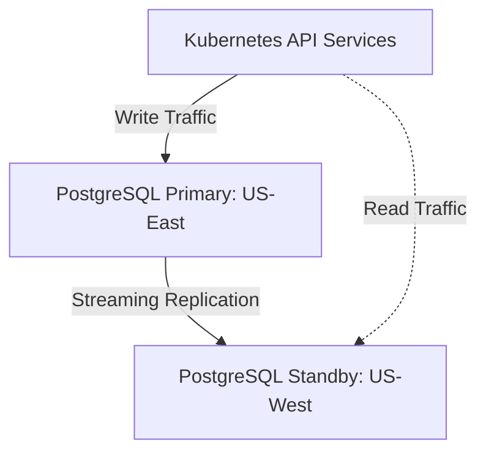

# SRE Incident Response Runbook: Database Failover

This runbook outlines the emergency failover procedure for PostgreSQL primary outages.

## Architecture Topology



## Failover Execution Checklist

1. Verify Primary unreachable via health check.
2. Promote standby cluster:
   ```bash
   patronictl -c /etc/patroni.yml failover
   ```
3. Validate replication status and error budgets.
